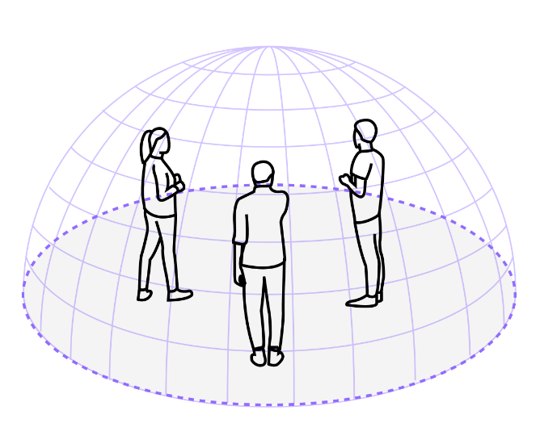

# Limited but useful features to note.

Collect View only shows your contributions so you can focus on your ideas. See how many people are working together (top left), colour your nodes (3 dots) and assign meaning you agree. Use emojis to react to someone else's contribution, meaning of emoji you agree.

Please note in most instances if you do not delete your nodes, they will be automatically deleted from your device and participants after 7 days.

::: details More Info {closed}

Browsers like Safari delete the local storage nodenogg.in uses after 7 days, others are slightly longer, revisiting nodenogg.in restarts this timer, if you delete your nodes after a session, copies may still be on other participants devices, until they sync which would require them to be online the same time as you or there own local storage is deleted.

:::

Please note the Export Markdown function currently allows any individual to export all the nodes (this includes other people's) during a session.

::: warning Note

Currently there is no way for other participants to stop this, this leans into the trust model of knowing who is in the "room" (microcosm) at the time, however, the plan is to introduce a consent method for exporting nodes you didn't create. To note the json export is only your own nodes.

:::

