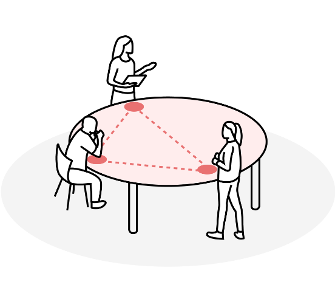

# How do I use nodenogg.in?

- Step 1. Visit https://nodenogg.in (this is a hosted instance of the app and sync engine by the University of Southampton) 

::: details More Info {closed}

nodenogg.in is free/libre local-first software, you can host the app and sync engine yourself anywhere and even local network only. [I want to do this](../deployment/01-overview)

:::

- Step 2. Click or tap Join, type in the microcosm name specified for your activity.

::: warning Note

Spaces in a microcosm name do not matter but the use of Capitals will create distinctive microcosms.

:::
- Step 3. Click or tap add, write notes in as many nodes as you want.

If you have a laptop, projector or large screen use this to switch from the Collect View to the Spatial view to see / show all contributions spatially.
